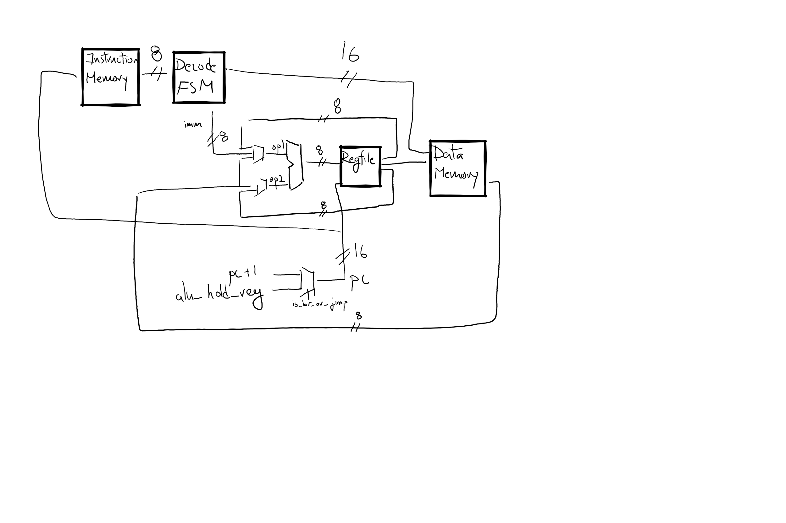

# 6502

MOS 6502 in verilog!

High level design:

---

What I did:
1. First wrote rtl/alu.sv and sim/test_alu.py kinda naively
   - clk, decimal_mode (BCD), carry_in, carry_out, half_carry are not being used in alu.sv

What I'm going to do:
1. Try to run a simple add two numbers program
   - Implement decoder and regfile initially for immediate addressing mode, then move on to other addressing modes one by one
2. Stretch - try to run some of these:
   - https://github.com/kdrnic/breakout6502
   - https://skilldrick.github.io/easy6502/#snake
   - Build a full system (Apple II?)
---

rtl:
- Contains verilog

sim:
- Contains testbenches

software:
- Uses https://github.com/skilldrick/6502js
- Contains some small assembly programs

resources:
- [Michael Steil's talk](https://www.youtube.com/watch?v=fWqBmmPQP40)
- https://skilldrick.github.io/easy6502/
